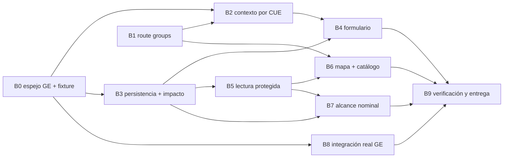

# Alertas de infraestructura — plan de ejecución por batches

Versión 2.0 · 16 de septiembre de 2026 · reemplaza a `plan.md`

Repositorio: `data-hub-dashboard`, rama base `feat/alerts`.

Este documento es el plan de ejecución. Sustituye al plan de propuesta (`plan.md`) porque cambian
cuatro decisiones de fondo: la fuente de datos quedó resuelta, el motor de impacto se simplificó a
una consulta, la ruta pública se resuelve con route groups en lugar de condicionales, y se incorpora
un alcance nominal con permiso especial que `plan.md` no contemplaba.

---

## 1. Qué se construye

Gestión Educativa entrega un enlace con el CUE. Todo lo que ocurre a partir de ahí es desarrollo
propio dentro de `data-hub-dashboard`.

1. El director abre el enlace recibido.
2. El formulario toma el CUE y recupera establecimiento, secciones y matrícula del espejo local.
3. El director informa la problemática, la severidad y selecciona las secciones afectadas.
4. El servidor guarda y calcula el impacto.
5. El mapa del Hub muestra la alerta, sin aprobación previa.
6. Un usuario con permiso especial —y solo ese— puede consultar qué alumnos concretos quedaron
   alcanzados, en una página aparte.

No hay selector de CUE, alta del director, rol nuevo para cargar, asignación usuario–CUE,
autenticación compartida ni servicio adicional que deba desarrollar Gestión Educativa.

---

## 2. Base verificada del repositorio

Revisión local sobre `616a4a8`. Todo lo de esta tabla fue leído, no supuesto.

| Pieza | Ubicación | Estado verificado |
|---|---|---|
| Next.js 16, React 19, TypeScript | `package.json` | Confirmado |
| MapLibre | `maplibre-gl` ^6.3.0, `react-map-gl` ^8.1.2 | Confirmado. **No hay Leaflet ni se agrega** |
| libSQL + Drizzle | `lib/db/index.ts`, `lib/db/schema.ts` | Confirmado, cliente en modo `file:` |
| DDL idempotente | `lib/db/seed.ts` | `executeMultiple(HUB_DDL)` corre en cada arranque, todo `CREATE TABLE IF NOT EXISTS` |
| Seed de recursos | `lib/db/seed.ts:206` | **Solo corre si `count(niveles) === 0`.** Agregar a `lib/model.ts` no impacta bases pobladas |
| ACL | `lib/acl.ts:22` | **`puedeAbrir()` devuelve `true` incondicional para `admin` y `editor`** |
| Validador de rutas | `lib/recurso-write.ts:30` | `isAllowedRuta()` ya acepta cualquier `/mapas/*`. No requiere cambio |
| Middleware | `middleware.ts` | Solo intercepta estáticos legacy. **No toca `/problematicas/*`** |
| Layout raíz | `app/layout.tsx` | Hardcodea `<HubDataProvider><AppShell>` sobre todo el árbol |
| Patrón de mapa | `app/mapas/matricula/` | `page.tsx` (sesión + ACL) + `map-client.tsx` (`dynamic`, `ssr:false`) |
| Componentes cartográficos | `components/mapas/` | `map-view`, `basemap-control`, `search-box`, `legend-panel`, `title-panel`, `fullscreen-button`, `feature-popup` |
| Pruebas | Vitest + Testing Library | `pnpm test`, `pnpm lint`, `pnpm build` |

### Prueba ejecutada

`ATTACH DATABASE` funciona con `@libsql/client` en modo file, y el JOIN entre bases también:

```
ATTACH OK -> [{"id":1,"cue":"1800505-00"}]
```

Esto habilita la base separada sin perder joins. Si esta prueba dejara de pasar, cae el diseño de
dos archivos y hay que volver a tablas `infra_` en `hub.sqlite`.

---

## 3. Fuente de datos

Resuelta contra el proyecto `plan_cope` (PlanCope, .NET), que ya integra Gestión Educativa en
producción.

| Endpoint GE | Devuelve | Volumen |
|---|---|---|
| `POST /token` | OAuth | 1 por corrida |
| `GET /api/externo/asistencias/GetSecciones` | `establecimientoCursoDivisionId`, `cueAnexo`, `curso`, `division`, `turno` | **1 llamada, toda la provincia** |
| `GET /api/externo/asistencias/GetAlumnosPorSeccionV2?cue=&cicloLectivo=` | `personaId` por sección | 1 por CUE |
| `GET /api/externo/asistencias/GetPersonasAlumnos?personaId=` | `apellido`, `nombre`, documento | solo alumnos nuevos o con cambio de sección |

Claves estables, y son el corazón del diseño:

- **Sección** → `geSectionId` (= `establecimientoCursoDivisionId`)
- **Alumno** → `gePersonId` (= `personaId`)

Throttle validado por PlanCope contra GE real: **5 concurrentes, pausa de 2 s**. No se inventa uno
nuevo.

---

## 4. Arquitectura

### Dos archivos SQLite bajo `DATA_DIR`

**`ge.sqlite`** — espejo de Gestión Educativa. Regenerable. Se sincroniza, no se edita.

```
ge_corte              (id, ciclo_lectivo, fetched_at, estado)
                       estado ∈ 'importando' | 'vigente' | 'historico'
ge_seccion            (corte_id, ge_section_id, cue_anexo, curso, division, nivel, turno)
ge_alumno_seccion     (corte_id, ge_section_id, ge_person_id)
ge_localizacion       (cue_anexo, cui, nombre, departamento, localidad, lat, lon)
ge_alumno_identidad   (ge_person_id, payload_cifrado)
```

`ge_alumno_seccion` son tres enteros. La identidad nominal vive aparte y cifrada (§4.3).

**`hub.sqlite`** — la base existente. Tablas nuevas:

```
infra_problematica          (id, cue_anexo, motivo, severidad, descripcion,
                             corte_id, creada_en, idempotency_key UNIQUE, origen)
infra_problematica_seccion  (problematica_id, ge_section_id)  UNIQUE
infra_permiso_nominal       (user_id, otorgado_por, otorgado_en, vence_en, motivo)
infra_acceso_nominal_log    (user_id, problematica_id, cantidad_alumnos, consultado_en)
```

`origen` se graba literal como `'enlace-cue'`. El contrato de solo-CUE permite validar la escuela,
no acreditar quién abrió el enlace; no se inventa un director autenticado.

**Puente**: `ATTACH DATABASE '$DATA_DIR/ge.sqlite' AS ge`, montado solo-lectura en la conexión del
Hub. Las alertas se escriben en `hub.sqlite` con transacción propia.

### 4.1 Motor de impacto

```sql
SELECT COUNT(DISTINCT s.ge_person_id)
FROM infra_problematica p
JOIN infra_problematica_seccion ps ON ps.problematica_id = p.id
JOIN ge.ge_alumno_seccion s ON s.ge_section_id = ps.ge_section_id
                           AND s.corte_id      = p.corte_id
```

Dos secciones de 25 alumnos distintos dan 50 y no la matrícula del CUE. Dos alertas sobre la misma
sección no duplican alumnos. No porque se programe el caso, sino porque `DISTINCT` sobre una clave
estable no puede hacer otra cosa.

La misma consulta sirve al impacto preliminar del formulario y al total confirmado. **Un solo camino
de cálculo**: preliminar y confirmado no pueden discrepar porque son el mismo SQL. El navegador
nunca calcula ni recibe membresías.

### 4.2 Zonas de la aplicación

Route groups, no condicionales dentro de `AppShell`.

```
app/
  layout.tsx              html, body, fuentes, Providers
  (hub)/
    layout.tsx            HubDataProvider + AppShell
    page.tsx, explorar/, mapas/, admin/, recursos/, reportes/, tableros/, login/, forbidden/
  (publico)/
    layout.tsx            encabezado institucional pelado, sin sesión ni navegación
    problematicas/nueva/
```

Las URLs no cambian: los paréntesis son invisibles para el router. El formulario público no puede
montar `AppShell` porque no está en su árbol — la separación la garantiza la estructura, no la
disciplina. Cero riesgo de orden de hooks, cero `useSession()` para un director sin cuenta.

### 4.3 Nominalización

El dato nominal entra al sistema. A partir de acá el Hub tiene PII y se trata como tal.

**Almacenamiento**: `ge_alumno_identidad.payload_cifrado`, AES-256-GCM, clave por variable de
entorno, nunca en la base ni en el repo. El importador cifra al escribir. La única función que
descifra vive detrás de la verificación de permiso.

**Permiso independiente del rol**:

```ts
// Deliberadamente NO consulta user.role.
export function puedeVerNominal(user: SessionUser | null, ahora: Date): boolean
```

Ser `admin` da la capacidad de **otorgar**, no de ver. Un admin que se lo otorgue a sí mismo queda
registrado en `otorgado_por`. `vence_en` es obligatorio: no existen grants permanentes.

**Ruta aparte, fuera del catálogo**:

```
app/(hub)/infraestructura/afectados/[problematicaId]/page.tsx
```

No cuelga de `/mapas/`, así que `isAllowedRuta()` la rechaza: **no puede registrarse como recurso
del catálogo aunque alguien lo intente**. No aparece en el explorador ni tiene audiencia que
configurar. Se llega por un enlace en la ficha de alerta que solo se renderiza si
`puedeVerNominal()`.

| | Mapa `/mapas/infraestructura` | Alcance `/infraestructura/afectados/[id]` |
|---|---|---|
| Gobierna | catálogo + audiencia (`puedeAbrir`) | `infra_permiso_nominal` (`puedeVerNominal`) |
| Entrega | agregados, coordenadas, cifras | apellido y nombre por sección |
| `admin` / `editor` | acceso total | **sin efecto** |
| Log de acceso | no | sí, cada consulta |

El payload del mapa es agregados para todos, siempre. No hay campos que filtrar según quién mira,
porque no hay respuesta compartida entre ambas vistas.

### 4.4 Dominio del formulario

Del mockup, que es la única fuente que los enumera:

- **Motivo**: Inundación · Anegamiento · Tormenta severa · Acceso interrumpido · Sin energía o agua ·
  Evacuación preventiva · Otro
- **Severidad**: Baja `#90B4E1` · Media `#FACD05` · Alta `#E58A2B` · Crítica `#F4492E`

`plan.md` no contemplaba severidad. Se incorpora: es una columna y un `<select>`, y sin ella el mapa
no puede priorizar.

---

## 5. Mapa de batches



**Camino crítico**: B0 → B3 → B5 → B6 → B9.

**Paralelizable**: B0 ‖ B1 al inicio. B2 ‖ B3 después de B0/B1. B7 ‖ B6 después de B5.
B8 puede correr en paralelo a todo lo demás una vez cerrado B0.

**Nunca en paralelo**: B1 con cualquier otro batch que toque `app/`. B1 mueve todo el árbol de
rutas; cualquier trabajo concurrente ahí genera conflictos mecánicos inútiles. B1 se abre y se
cierra solo.

### Por qué la integración real con GE es B8 y no B1

Los batches B0 a B7 se construyen y se testean enteros contra fixture. Atar el formulario y el motor
de impacto a tener credenciales de GE el día uno deja el proyecto parado esperando un token que no
depende de nosotros. El fixture tiene la forma exacta del dato real; cuando las credenciales estén,
B8 cambia el origen y nada más.

---

## 6. Batches

### B0 · Espejo de Gestión Educativa, cortes y fixture

**Objetivo.** Tener una base `ge.sqlite` consultable, con un corte vigente cargado desde fixture, y
el puente `ATTACH` funcionando desde el Hub. Es la fundación: sin esto no hay secciones que mostrar
ni alumnos que contar.

**Dependencias.** Ninguna. Es la raíz.

**Tareas principales.**

1. `lib/infraestructura/types.ts` — tipos del módulo: corte, sección, localización, membresía.
2. `lib/infraestructura/cue.ts` — normalización y validación de CUE/anexo como identificadores de
   texto. Un CUE base agrupa sus localizaciones conocidas; si el formato recibido trae anexo, se
   preserva ese alcance. **No se convierte silenciosamente un CUE base en anexo `00`.**
3. `lib/infraestructura/ge-db.ts` — apertura de `ge.sqlite`, DDL idempotente (`CREATE TABLE IF NOT
   EXISTS`), y `ATTACH` solo-lectura sobre la conexión del Hub. Ruta derivada de `lib/data-dir.ts`,
   nunca hardcodeada.
4. `scripts/sync-ge.mjs --fixture` — carga un corte sintético con la forma exacta del real:
   secciones con `ge_section_id`, membresías `(corte_id, ge_section_id, ge_person_id)`, y al menos
   un caso de alumno en dos secciones (para probar la unión) y un CUE con dos niveles.
5. Extracción de `ge_localizacion` desde las fuentes que ya están en el repo: `index.html` (el array
   `DATA`, **2005 registros medidos**, con CUE, nombre, depto, localidad, lat, lon y `geo_calidad`) y
   `public/data/establishments.geojson` (288 features). **Conciliación por `cue_anexo`, nunca por
   posición de fila ni por nombre.** Coordenadas faltantes quedan `NULL`, no cero ni cadena vacía.
   Persistir también `geo_calidad`, disponible en `index.html`.
6. Activación transaccional del corte: se escribe con `estado='importando'`, se verifican invariantes
   (toda sección tiene CUE existente; toda membresía apunta a una sección del mismo corte), y recién
   entonces pasa a `'vigente'` degradando el anterior a `'historico'`.
7. Índices: `ge_seccion` por `(corte_id, cue_anexo)`, `ge_alumno_seccion` por
   `(corte_id, ge_section_id)`.
8. Borrar `index.html` una vez extraído el dato. Su único valor era ese array.

**Paralelización.** Tareas 1–3 son una unidad (esquema y puente). Tareas 4–5 son otra unidad
(importadores). La 6 depende de ambas. Dos implementadores.

**Criterios de aceptación.**

- `pnpm test` cubre normalización de CUE incluyendo base vs. anexo y entradas inválidas.
- Un corte a medio importar nunca es leído: con un corte en `'importando'`, la consulta de corte
  vigente devuelve el anterior.
- El `ATTACH` permite un `JOIN` entre `hub.sqlite` y `ge.` en una sola consulta, con test que lo
  demuestra.
- `ge_localizacion` carga los **2005** registros; los **4** sin coordenada quedan `NULL` y **siguen
  presentes en la tabla**.
- `cui` queda `NULL` en los 2005 registros y la columna se conserva en el esquema. **No es un dato
  faltante: es una dependencia de datos declarada pendiente** (ver más abajo). El importador lo
  documenta en el código y el reporte del batch lo declara pendiente, nunca completado.
- El DDL corre dos veces seguidas sin error y sin duplicar datos.
- `index.html` ya no existe en el repositorio.

**Pruebas y QA.** Vitest sobre base temporal en `DATA_DIR` de test. Verificar sobre una copia de una
`hub.sqlite` poblada que el `ATTACH` no altera las tablas existentes.

**Riesgos.**

- *`ATTACH` restringido en el entorno de producción* — bajo, pero verificado solo en local. Si el
  build de libSQL de producción lo rechaza, **detener y escalar**: el fallback es mover las tablas
  `ge_` a `hub.sqlite` con prefijo, lo que cambia B0 y nada más.
- *La conciliación por nombre tienta cuando falta el CUE* — media. Está explícitamente prohibida.
  Un registro sin CUE se descarta y se reporta, no se adivina.
- *El CUI no tiene fuente en el repositorio* — **confirmado el 16/09/2026, no es un riesgo: es un
  hecho**. Ni `index.html` (39 campos, ninguno `cui`) ni `establishments.geojson` (12 propiedades)
  lo traen, y no hay planilla `.xlsx`/`.csv` en el repo. Los números `2049 / 56 sin CUI / 47 sin
  coordenadas` que este documento arrastraba venían de «la planilla de localizaciones» que listaba
  `plan.md` y que **nunca entró al repositorio**; la v2.0 quitó la planilla de las fuentes pero
  conservó sus cifras. Consecuencia para los batches siguientes: donde B5 exige distinguir CUE,
  localizaciones e **inmuebles**, el recuento de inmuebles **no está disponible** y se informa como
  tal — nunca como cero. La fuente real llega con B8.

---

### B1 · Separación de zonas: route groups `(hub)` y `(publico)`

**Objetivo.** Que exista una zona pública sin `AppShell` ni `HubDataProvider`, garantizada por la
estructura de carpetas y no por condicionales. Habilita el formulario del director sin tocar la
navegación del Hub.

**Dependencias.** Ninguna. **No se paraleliza con nada que toque `app/`.**

**Tareas principales.**

1. Crear `app/(hub)/layout.tsx` con `HubDataProvider` + `AppShell`. Mover ahí, sin modificar su
   contenido, todas las rutas actuales: `page.tsx`, `explorar/`, `mapas/`, `admin/`, `recursos/`,
   `reportes/`, `tableros/`, `login/`, `forbidden/`, `api/` según corresponda.
2. Reducir `app/layout.tsx` a `html`, `body`, fuentes y `Providers`.
3. Crear `app/(publico)/layout.tsx`: encabezado institucional, sin menú de cuenta, sin navegación
   administrativa, sin invitación a iniciar sesión.
4. Verificar que `middleware.ts` no requiere cambios (su matcher apunta a estáticos legacy).
5. Placeholder `app/(publico)/problematicas/nueva/page.tsx` que renderiza y no depende de sesión.

**Paralelización.** Ninguna. Un implementador, un batch corto.

**Criterios de aceptación.**

- Todas las URLs existentes responden igual que antes: `/`, `/explorar`, `/mapas/matricula`,
  `/admin`, `/recursos/[id]`, `/login`, `/forbidden`.
- `pnpm build` y `pnpm test` pasan sin cambios en los tests existentes.
- La ruta pública renderiza **sin** disparar `authClient.useSession()`, verificado en test.
- `AppShell` no recibe ningún parámetro ni condicional nuevo. Su diff es vacío.

**Pruebas y QA.** Suite completa antes y después; el conjunto de tests que pasa debe ser idéntico.
Recorrido manual de las rutas de la tabla anterior.

**Riesgos.**

- *Imports relativos rotos al mover carpetas* — alta probabilidad, impacto bajo. El proyecto usa
  alias `@/`, lo que lo mitiga; revisar los relativos que queden.
- *Alguien "aprovecha" para refactorizar `AppShell`* — explícitamente fuera de alcance. El diff de
  `AppShell` debe ser vacío; si no lo es, el batch se rechaza.

---

### B2 · Contexto por CUE

**Objetivo.** Que un enlace resuelva exactamente la escuela esperada y devuelva sus secciones con
matrícula agregada, sin pedirle al director que identifique nada.

**Dependencias.** B0 (espejo), B1 (zona pública).

**Tareas principales.**

1. `lib/infraestructura/contexto.ts` — resolución por CUE contra el corte vigente: localización,
   secciones agrupadas por turno y nivel, matrícula por sección.
2. `app/api/problematicas/contexto/route.ts` — `GET ?cue=`. Valida y normaliza antes de consultar.
3. Respuesta: nombre de sección, turno, nivel y **matrícula agregada**. Nunca `ge_person_id`, nunca
   identidades.
4. Estados de error entendibles: CUE ausente, CUE inexistente en el corte, CUE sin secciones. **En
   ningún caso se ofrece una lista de CUE alternativos.**
5. Página `app/(publico)/problematicas/nueva/page.tsx` mostrando escuela y secciones como lectura.

**Paralelización.** Tareas 1–2 y 4 son una unidad. Tarea 5 es otra. Dos implementadores.

**Criterios de aceptación.**

- CUE válido: devuelve la escuela correcta y **únicamente** sus secciones.
- CUE base y CUE–anexo no se confunden; hay test para ambos.
- CUE inexistente o faltante: error claro, sin padrón alternativo.
- La respuesta del endpoint no contiene ningún `ge_person_id`, verificado por test sobre el payload.
- El endpoint responde sin sesión.

**Pruebas y QA.** Vitest contra el fixture de B0, incluyendo el CUE con dos niveles.

**Riesgos.**

- *Filtración de membresías por conveniencia del front* — media. El test del payload es la defensa;
  no se relaja aunque complique el cálculo preliminar del cliente, que de todos modos no debe
  calcular.

---

### B3 · Persistencia de problemáticas y motor de impacto

**Objetivo.** Guardar una problemática de forma consistente y calcular alumnos, secciones y
establecimientos afectados enteramente del lado del servidor.

**Dependencias.** B0.

**Tareas principales.**

1. Tablas `infra_problematica` e `infra_problematica_seccion` en `lib/db/schema.ts` **y** en el
   `HUB_DDL` de `lib/db/seed.ts`. Modificar solo Drizzle no crea tablas en instalaciones existentes.
2. `lib/infraestructura/validacion.ts` — Zod: motivo del catálogo cerrado, severidad del catálogo
   cerrado, descripción acotada y sin HTML, CUE válido, lista de secciones no vacía.
3. Rechazo de secciones que no pertenezcan al CUE recibido, verificado contra `ge.ge_seccion`.
   **No se aceptan totales enviados por el navegador como resultado oficial.**
4. `app/api/problematicas/route.ts` — `POST`. Guarda problemática y secciones en **una sola
   transacción**.
5. Idempotencia: `idempotency_key` `UNIQUE`. Mismo contenido devuelve la alerta ya creada; contenido
   distinto con la misma clave devuelve `409`.
6. `lib/infraestructura/impacto.ts` — la consulta de §4.1. Cuenta alumnos por `DISTINCT
   ge_person_id`; secciones, CUE y CUI distintos se cuentan **por separado**, no se mezclan.
7. Endpoint de impacto preliminar que reutiliza exactamente la misma función.
8. Límites del endpoint público: máximo de alertas activas por CUE en ventana de tiempo, rate limit
   por IP, techo de secciones acotado a las que el CUE realmente tiene.
9. El `corte_id` de la problemática se conserva para siempre. Secciones que no puedan resolverse en
   el corte vigente se marcan **cálculo incompleto**; no desaparecen del conteo de alertas.

**Paralelización.** Tareas 1–5 y 8 son una unidad (persistencia y contrato). Tareas 6–7 y 9 son otra
(cálculo). Dos implementadores.

**Criterios de aceptación.**

- Dos secciones de 25 alumnos distintos producen 50, no la matrícula total del CUE.
- Dos alertas sobre la misma sección no duplican alumnos en el consolidado.
- Un CUI compartido no marca automáticamente otros CUE como afectados.
- Matrícula faltante se informa como **incompleta**, nunca como cero.
- Un reintento con el mismo contenido no crea una segunda alerta; con contenido distinto devuelve
  `409`.
- Si falla el guardado, no queda una alerta sin sus secciones.
- La actualización de datos no altera el cálculo de registros anteriores.
- El DDL nuevo corre sobre una copia de `hub.sqlite` poblada sin pérdida.
- Superar el límite por CUE o por IP devuelve error y no persiste.

**Pruebas y QA.** Vitest con fixture, incluyendo el alumno presente en dos secciones. Aplicar el DDL
sobre una copia real de `hub.sqlite`.

**Riesgos.**

- *Endpoint público de escritura* — es un agujero conocido y aceptado por el contrato de solo-CUE.
  Los límites de la tarea 8 acotan el daño a algo reversible; no lo eliminan. Si aparece abuso real,
  **escalar** antes de inventar autenticación que Gestión Educativa no va a proveer.
- *Cálculo duplicado en cliente* — media. La tarea 7 existe precisamente para que no haya dos
  implementaciones del mismo número.

---

### B4 · Formulario del director

**Objetivo.** Completar el recorrido desde el enlace con CUE hasta la confirmación de carga, usable
en un teléfono.

**Dependencias.** B2, B3.

**Tareas principales.**

1. `components/infraestructura/formulario-problematica.tsx` — motivo, severidad, secciones,
   descripción opcional.
2. `components/infraestructura/secciones-selector.tsx` — agrupado por turno y localización solo para
   facilitar lectura, con «todas las secciones» dentro del alcance recibido.
3. Establecimiento y CUE como texto de referencia. **Sin input editable, sin selector.**
4. Impacto preliminar consultado al servidor (B3 tarea 7) y reemplazado por el confirmado al
   guardar.
5. Estado de envío, bloqueo de doble envío, conservación de campos ante fallo de conexión.
6. Confirmación **solo después de persistir**, mostrando los totales reales. No se redirige al login
   del Hub.
7. Estilos mínimos del módulo en `app/globals.css`, nada más.

**Paralelización.** Tareas 1–3 y 7 son una unidad. Tareas 4–6 son otra. Dos implementadores.

**Criterios de aceptación.**

- En un viewport de teléfono se abre un enlace válido, se identifica la escuela precargada, se
  seleccionan dos secciones y se guarda.
- No aparece lista de CUE, rol nuevo, alta de usuario ni pregunta sobre la organización educativa.
- El formulario opera completo con teclado y sin mapa.
- Un error de envío no obliga a completar todo de nuevo.
- Doble clic en guardar produce una sola alerta.
- El total confirmado coincide con el preliminar para la misma selección.

**Pruebas y QA.** Testing Library con interacción de teclado. Verificación manual en viewport de
teléfono, incluyendo corte de conexión durante el envío.

**Riesgos.**

- *El preliminar y el confirmado discrepan* — bajo si se respeta el único camino de cálculo. Si
  discrepan, es un bug de B3, no de presentación: no se maquilla en el front.

---

### B5 · Lectura protegida e indicadores consolidados

**Objetivo.** Entregar un único resultado coherente para puntos, lista e indicadores del mapa.

**Dependencias.** B3.

**Tareas principales.**

1. `lib/infraestructura/consulta.ts` — alertas activas y filtros por territorio, nivel,
   establecimiento, motivo y severidad.
2. `lib/infraestructura/acceso-lectura.ts` + `app/api/mapas/infraestructura/route.ts` — protección
   con `getSessionUser()`, `loadRecursoAccessByRuta('/mapas/infraestructura')` y `puedeAbrir()`.
   **La protección se repite en el route handler; no se hereda de la página.**
3. Conteos por unión, nunca sumando las cifras de cada alerta.
4. Población acotada al nivel filtrado: un CUE con varios niveles no aporta toda su matrícula a uno
   solo.
5. **Un solo universo** para lista, indicadores y puntos. Los casos sin coordenadas permanecen en
   lista y totales.
6. Payload: coordenadas, identificación institucional, motivo, severidad, cifras y fecha. **Nada
   nominal, para nadie.**
7. Conteos absolutos. Si se muestran porcentajes, el denominador es el universo educativo filtrado,
   no solo las escuelas que ya tienen alerta.
8. Sin caché compartida de respuestas autorizadas: cada consulta comprueba el acceso vigente.

**Paralelización.** Tareas 1, 3–5 y 7 son una unidad (consulta). Tareas 2, 6 y 8 son otra
(protección y contrato). Dos implementadores.

**Criterios de aceptación.**

- Sin sesión o sin audiencia permitida, **la API** no entrega el conjunto del mapa. Test explícito
  contra el endpoint, no contra la página.
- Un usuario permitido obtiene el mismo total en lista e indicadores.
- Varios incidentes sobre una escuela cuentan una escuela afectada.
- Se distinguen cantidad de CUE, localizaciones e inmuebles sin mezclarlas.
- Los casos sin CUI o sin coordenadas se informan y **no se excluyen** de los totales.
- El payload no contiene ningún campo nominal, verificado por test.

**Pruebas y QA.** Vitest con usuarios de cada rol y con audiencia configurada y vacía.

**Riesgos.**

- *Proteger la página y dejar la API abierta* — es el agujero clásico y el motivo de la tarea 2. El
  test del endpoint sin sesión es obligatorio.

---

### B6 · Mapa de infraestructura y alta en el catálogo

**Objetivo.** Publicar la experiencia de consulta dentro del sistema de mapas y catálogo existente.

**Dependencias.** B5, B1.

**Tareas principales.**

1. `app/(hub)/mapas/infraestructura/page.tsx` — calco del patrón de `matricula`: `ensureSeeded`,
   sesión, ACL, `redirect`.
2. `app/(hub)/mapas/infraestructura/map-client.tsx` — `dynamic(..., { ssr: false })`, mismo
   mecanismo de carga diferida.
3. `components/mapas/map-infraestructura-page.tsx` reutilizando `map-view`, `basemap-control`,
   `search-box`, `legend-panel`, `title-panel`, `fullscreen-button`, `feature-popup`.
4. Componentes de dominio nuevos: `components/infraestructura/indicadores.tsx`, `lista-alertas.tsx`,
   `ficha-alerta.tsx`.
5. Alertas activas como puntos, con agrupación visual al superponerse. CUI compartido explica el
   inmueble; **no multiplica afectaciones**. Color por severidad según §4.4.
6. **Sin botones de crear, editar ni finalizar.** El mapa del Hub es de consulta.
7. Alta del recurso con ID estable, ruta `/mapas/infraestructura`, formato mapa, nivel transversal,
   categoría infraestructura, reutilizando los tags territorial y alertas existentes.
8. **Upsert idempotente del recurso**, ejecutado fuera del `if (count(niveles) === 0)` de
   `lib/db/seed.ts:206`. Debe funcionar sobre una base ya poblada y **respetar la audiencia
   configurada**, sin pisarla en reinicios.
9. `lib/infraestructura/use-alertas.ts` — polling de 15 s, pausa con pestaña oculta, refresco al
   recuperar foco, cancelación al desmontar. Sin WebSockets.
10. Verificar `isAllowedRuta`, `resourceCardTarget`, explorador y navegación.

**Paralelización.** Tareas 1–6 y 9 son una unidad (mapa). Tareas 7–8 y 10 son otra (catálogo). Dos
implementadores.

**Criterios de aceptación.**

- Se guarda una problemática en el formulario y aparece al consultar el mapa en la petición
  siguiente, **sin cola de aprobación**.
- Una pestaña ya abierta la incorpora en el siguiente ciclo de 15 s.
- Los totales coinciden con las secciones seleccionadas y los filtros aplicados.
- El recurso aparece en el catálogo de una base **ya poblada**, no solo en una virgen.
- Reiniciar la aplicación dos veces no altera la audiencia configurada del recurso.
- El mapa de matrícula sigue funcionando igual.

**Pruebas y QA.** Recorrido en dos ventanas: cargar en el formulario, ver aparecer en el mapa.
Ejecutar el seed sobre copia de `hub.sqlite` poblada con audiencia ya configurada.

**Riesgos.**

- *El upsert pisa la audiencia* — media y con consecuencia visible: un recurso restringido pasaría a
  abierto. El test de doble reinicio es obligatorio.
- *Tentación de agregar acciones de gestión en el mapa* — fuera de alcance. La actualización o
  finalización de una problemática no entra en esta entrega.

---

### B7 · Alcance nominal: cifrado, permiso especial y auditoría

**Objetivo.** Permitir que un usuario expresamente habilitado consulte qué alumnos concretos quedaron
alcanzados por una alerta, con el dato cifrado en reposo y cada acceso registrado.

**Dependencias.** B3, B5.

**Tareas principales.**

1. `ge_alumno_identidad (ge_person_id, payload_cifrado)` en `ge.sqlite`. AES-256-GCM, clave desde
   variable de entorno. **La clave nunca en la base, nunca en el repositorio, nunca en logs.**
2. `lib/infraestructura/identidad.ts` — cifrado al importar y descifrado; la función que descifra es
   la única que toca el payload y no se exporta fuera del módulo.
3. Tablas `infra_permiso_nominal` e `infra_acceso_nominal_log` en schema **y** `HUB_DDL`.
4. `lib/infraestructura/permiso-nominal.ts` — `puedeVerNominal(user, ahora)`. El rol `admin`
   **accede sin grant**; para cualquier otro rol verifica grant vigente y no vencido. Ver la
   revisión al pie de este batch.
5. Administración del permiso: otorgar, revocar y listar, con `vence_en` obligatorio y `otorgado_por`
   registrado. Accesible solo a `admin`.
6. `app/api/infraestructura/nominal/route.ts` — `GET ?problematica=`. Verificación propia, no
   heredada del mapa. Escribe en `infra_acceso_nominal_log` en la misma transacción que sirve la
   respuesta.
7. `app/(hub)/infraestructura/afectados/[problematicaId]/page.tsx` — lista por sección. **Sin export,
   sin descarga, sin copia masiva** en esta entrega.
8. Enlace desde `ficha-alerta.tsx` renderizado únicamente si `puedeVerNominal()`.
9. Procedimiento documentado de rotación de la clave de cifrado.

**Paralelización.** Tareas 1–2 y 9 son una unidad (criptografía). Tareas 3–6 son otra (permiso y
auditoría). Tareas 7–8 dependen de ambas. Dos implementadores, luego uno.

**Criterios de aceptación.**

- Un usuario `admin` **sin** grant vigente recibe `200`, ve el enlace y **queda igual una fila** en
  `infra_acceso_nominal_log`. Test explícito.
- Un usuario `admin` baneado recibe `403` pese al rol.
- Un usuario `editor` sin grant recibe `403`.
- Un grant vencido no da acceso.
- Un usuario con grant vigente obtiene los nombres y **queda una fila** en
  `infra_acceso_nominal_log` con su id, la problemática y la cantidad.
- El payload del mapa (B5) sigue sin contener nada nominal.
- Inspeccionar `ge.sqlite` con un lector SQLite no revela ningún nombre en claro.
- La ruta `/infraestructura/afectados/...` es rechazada por `isAllowedRuta()`, verificado por test.
- El procedimiento de rotación de clave está documentado y probado sobre una copia.

**Pruebas y QA.** Vitest con matriz de casos: sin sesión, `consulta`, `editor`, `admin` sin grant,
con grant vigente, con grant vencido. Inspección manual del archivo `.sqlite` buscando nombres en
claro.

**Riesgos.**

- *Se filtra lo nominal al payload del mapa* — el diseño de rutas separadas lo previene, pero el
  test de B5 tarea 6 se mantiene vigente como red.
- *Pérdida de la clave* — impacto alto: los nombres quedan irrecuperables y hay que re-sincronizar
  desde GE. La documentación de la tarea 9 debe decirlo con estas palabras.
- *El permiso se extiende a `editor`* — sería el fin del control: `lib/acl.ts` ya le da `true`
  incondicional en `puedeAbrir()`, así que `infra_permiso_nominal` quedaría sin efecto para el
  grueso del staff. El código documenta por qué el atajo llega hasta `admin` y no más.

#### Revisión: `admin` accede sin grant

El criterio original era que el rol nunca alcanzara y que **todo** acceso nominal exigiera un grant
en `infra_permiso_nominal`. Se revisó a pedido del titular del dato, por dos razones:

1. `otorgarPermisoNominal` nunca impidió el auto-otorgamiento: un `admin` podía darse el permiso a
   sí mismo en cualquier momento. Para ese rol el grant no era una barrera, era un trámite previo.
2. Lo que de verdad sostiene el control es la **auditoría**, no la puerta:
   `consultarYRegistrarAfectados` escribe en `infra_acceso_nominal_log` en la misma transacción que
   devuelve los nombres. Un admin que mira queda registrado, con grant o sin él.

Lo que **no** cambió: `editor` y `consulta` siguen necesitando grant vigente y no vencido, los
grants siguen sin poder ser permanentes (`vence_en` obligatorio), y un usuario baneado no entra por
ningún camino.

---

### B8 · Integración real con Gestión Educativa

**Objetivo.** Reemplazar el fixture por el origen real, con el throttle y el manejo de fallos que la
API de GE exige.

**Dependencias.** B0. Puede correr en paralelo a B2–B7.

**Tareas principales.**

1. Cliente de GE: `POST /token`, `GetSecciones`, `GetAlumnosPorSeccionV2`, `GetPersonasAlumnos`.
2. Throttle de **5 concurrentes con pausa de 2 s**, tomado de PlanCope, no reinventado.
3. `GetPersonasAlumnos` solo para alumnos nuevos o con cambio de sección, diferenciando contra el
   corte anterior.
4. Descarte explícito en el importador de todo campo que no se persiste. Lo que GE devuelva de más
   no entra al esquema.
5. Reanudación ante fallo parcial: una corrida interrumpida no deja un corte activo ni obliga a
   empezar de cero.
6. Documentación del enlace final con `cue`, los cortes cargados y cómo mantenerlos.
7. Credenciales por variable de entorno; nunca en el repositorio.

**Paralelización.** Tareas 1–3 son una unidad. Tareas 4–5 otra. Dos implementadores.

**Criterios de aceptación.**

- Una corrida real produce un corte `'vigente'` con secciones y membresías coherentes.
- El conteo de secciones y alumnos por CUE se concilia contra una muestra verificada a mano.
- Interrumpir la corrida a mitad deja el corte en `'importando'` y el mapa sirviendo el anterior.
- Ningún campo no declarado en §4 aparece en `ge.sqlite`.
- Ninguna credencial aparece en el repositorio ni en los logs.

**Pruebas y QA.** Corrida contra el entorno real de GE con un subconjunto acotado de CUE antes de la
provincia completa.

**Riesgos.**

- *Credenciales no disponibles a tiempo* — es el motivo de que este batch esté desacoplado. Si no
  llegan, B0–B7 y B9 cierran igual contra fixture y este batch queda pendiente, **declarado como
  pendiente y no como completado**.
- *GE cambia el contrato* — medio. Las formas están tomadas de una integración en producción, pero
  de otro proyecto; conciliar contra muestra real es parte de la aceptación.

---

### B9 · Verificación integral y entrega

**Objetivo.** Un incremento desplegable con evidencia de que funciona dentro del Hub y de que no
rompió lo que ya andaba.

**Dependencias.** B4, B6, B7, B8.

**Tareas principales.**

1. Recorrido completo sobre datos conocidos: enlace con CUE → contexto → formulario → persistencia →
   cálculo → mapa protegido → alcance nominal con permiso.
2. Regresiones: mapa de matrícula, login, catálogo, audiencias, administración de usuarios, visor de
   recursos.
3. `pnpm test`, `pnpm lint` y `pnpm build`. Corregir lo introducido; **documentar lo preexistente
   sin ampliar el cambio**.
4. Despliegue con la infraestructura del proyecto y `DATA_DIR`: reiniciar no pierde alertas ni repite
   importaciones destructivas.
5. Prueba sobre copia consistente de `hub.sqlite`. Documentar migraciones aditivas y una reversión de
   aplicación que conserve los registros nuevos. **No restaurar una copia antigua encima de cargas
   nuevas válidas.**
6. Documentar qué quedó pendiente y con qué limitación de datos.
7. Revisión de código antes del merge, por el flujo del repositorio.

**Paralelización.** Tareas 1–2 son una unidad. Tareas 4–5 otra. Las demás, secuenciales al final.

**Criterios de aceptación.**

- El recorrido completo está verificado con evidencia: comandos corridos y su salida.
- No hay cambios de roles del Hub ni pasos nuevos exigidos a Gestión Educativa.
- Reiniciar la aplicación conserva alertas, cortes y grants.
- La entrega enumera explícitamente lo no hecho.

**Pruebas y QA.** Suite completa más recorrido manual en teléfono y escritorio. Despliegue de prueba
con volumen persistente.

**Riesgos.**

- *Declarar completo un batch parcial* — es el único fallo que rompe toda la cadena de validación.
  Lo no hecho se reporta como no hecho.

---

## 7. Fuera de alcance

- Rol Director y padrón de permisos director–CUE.
- Selector, buscador o listado de CUE en el formulario.
- SSO, tokens o validaciones a desarrollar por Gestión Educativa.
- Alta de usuarios para cargar la problemática.
- Asignación de responsables, seguimiento de obras o reparaciones.
- Moderación previa a la publicación de la alerta.
- Predicciones, prioridades automáticas y notificaciones.
- Exportación de datos nominales, adjuntos y operación sin conexión.
- Actualización o finalización de una problemática. La base queda preparada para esa evolución; el
  producto inicial las identifica como «problemáticas reportadas» y muestra su fecha. Hasta definir
  cómo se finalizan, **no se presenta su persistencia como verificación continua de que el problema
  sigue ocurriendo**.

---

## 8. Reglas transversales

Aplican a todos los batches y se verifican en cada uno.

| Regla | Afirmación |
|---|---|
| Cálculo | Un solo camino. Preliminar y confirmado usan la misma función. |
| Nominal | Nunca en el payload del mapa. Nunca sin grant vigente. Nunca sin log. |
| Protección | Cada route handler verifica por su cuenta. No se hereda de la página. |
| Cortes | Un corte referenciado por una alerta no se borra. |
| Transacciones | Alerta y secciones se guardan juntas o no se guardan. |
| DDL | Todo `CREATE TABLE IF NOT EXISTS`, idempotente sobre base poblada. |
| Secretos | Claves y credenciales solo por entorno. Nunca en repo, base ni logs. |
| Commits | Conventional commits. Sin atribución de IA, sin `Co-Authored-By`. |
| Alcance | No se mezclan refactorizaciones generales del Hub con esta funcionalidad. |
| Honestidad | Un batch parcial se reporta parcial. Un test que falla se reporta fallando. |
